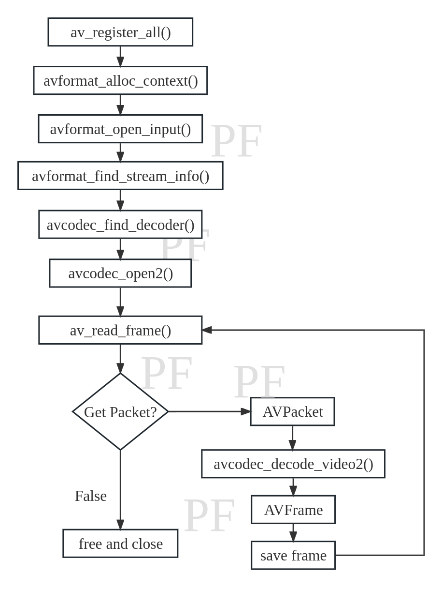
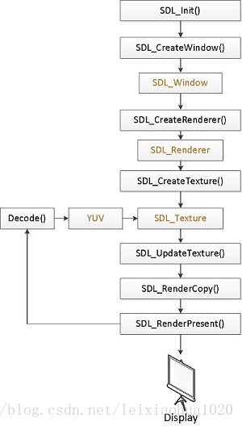

# tiny_video_player
本项目将基于 FFmpeg4.1 和 SDL2.0 分布实现一个简单的播放器。

## FFmpeg
下载 FFmpeg，因为 FFmpeg 版本较多，且不同版本之间的 API 略有不同，本项目选取 ffmpeg-4.1 作为学习的版本（[下载地址](http://www.ffmpeg.org/releases/)）。下载完成解压到 tiny_video_player 目录下，执行如下命令进行安装。

```shell
cd ffmpeg-4.1
./configure --enable-gpl --enable-libx264 --prefix=./build --enable-shared
make
make install
```
其中，gpl和libx264是额外的库，可根据情况选择，默认都是disable。
--prefix：指定安装路径，如果不指定，头文件会默认安装在/usr/local/include，库会默认在/usr/local/lib
--enable-shared：选择编译动态库，如果不加上这一句，编译出来的只有静态库（.a），加上之后才有动态库（.so）

## tutorial01 解码并保存图像帧
调用流程图如下图，具体函数作用可阅读代码注释。

```shell
cd tutorial01
mkdir build
cmake ..
make
./decode_frame
```

## tutorial02 基于 SDL2.0 视频播放器
下载 [SDL2](https://github.com/libsdl-org/SDL/releases)，执行如下命令，编译和安装
```shell
cd SDL
./configure --prefix=you_path/tiny_video_player/sdl2
make
make install
```
SDL 显示流程如下所示：
